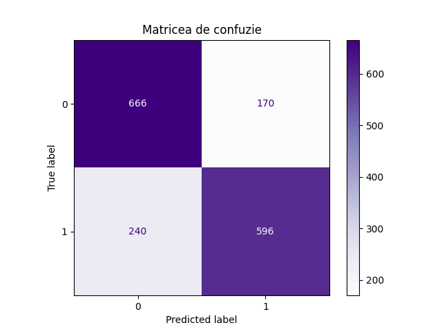

*Autor: Nicolau Ianis, 311 CD*

# Predictia Delincventei Financiare

# Partea I

## 1. Tipul Problemei

### Problema de clasificare

Cum poate o institutie financiara sa anticepeze daca un client va intarzia cu plata unui credit in urmatorii 2 ani de la acordare, pe baza profilului sau financiar anterior?
Scopul este de a identifica din timp clientii cu risc ridicat pentru a reduce pierderile si a imbunatati deciziile de acordare a creditului.
Solutia noastra antreneaza un model de clasificare binara pe baza acestor caracteristici financiare.

---

## 2. Structura Setului de date

Pornim de la un set de date extras de pe [Kaggle](https://www.kaggle.com/datasets/adilshamim8/credit-risk-benchmark-dataset
) pe care l-am prelucrat pentru a imbunatati antrenarea propriu-zisa.

### Coloane originale:
- `rev_util`	- Cat de mult din limita de credit (carduri, linii de credit) a fost deja folosita.
- `age` - Varsta Persoanei.
- `late_30_59, late_60_89, late_90` - De cate ori a intarziat intre 30 si 59/ 60 si 89/ 90 sau mai multe zile cu plata unei datorii.
- `debt_ratio` - Cat la suta din venitul lunar se duce pe platit datorii.
- `monthly_inc` - Venitul lunar brut (Inainte de taxe).
- `open_credit` - Cate linii de credit sau imprumuturi are deschise in prezent.
- `real_estate` - Cate credite ipotecare sau imprumuturi pentru locuinta are.
- `dependents` - Cate persoane are in intretinere.
- `dlq_2yrs` - Tinta: intarziere grava în urmatorii 2 ani (`0` sau `1`)

---

## 3. Caracteristici

Am efectuat urmatoarele modificari:
- unificarea celor 3 coloane de intarziere a platii, in `late`.
- adaugarea coloanei `inc_per_dep`, care va calcula salariul lunar pentru individ, tinand cont de faptul ca este conditionat de membrii familiei.
- inlocuirea coloanei `dependents` in `relationship_status` pentru diversificarea tipurilor de date.

### Coloane finale:

| Nume               | Tip       | Descriere |
|--------------------|-----------|-----------|
| `rev_util`         | float     | Utilizarea limitei cardului procentuale |
| `age`              | int       | Varsta |
| `debt_ratio`       | float     | Venit dedicat datoriilor procentual |
| `monthly_inc`      | int       | Salariu |
| `open_credit`      | int       | Credite active |
| `real_estate`      | int       | Imprumuturi pentru locuinta |
| `late`             | string    | Valoare categoriala (`none`, `low`, ...) |
| `inc_per_dep`      | float     | Venit per membrii familiei |
| `relationship_status` | string | Valoare categoriala |
| `dlq_2yrs`         | int (target) | 0/1 - intarziere grava în 2 ani |

---

## 4. Salvarea dataseturilor

Setul de date final contine aproximativ 16.000 de înregistrari, impartite in: 14.400 pentru antrenare si 1.600 pentru testare

1. **Separarea in 2 clase** (`dlq_2yrs == False`, respectiv `dlq_2yrs == True`)
2. **Impartirea in fisierele train/test** (90% train, 10% test)

### Fisierele

- `train_0.csv`
- `test_0.csv`
- `train_1.csv`
- `test_1.csv`

---

## 5. Documentare

Toate aceste modificari aduc la un set de date diversificat pe care il putem utiliza pentru determinarea delincventei unei persoane.

Totodata, am ales sa fac o simulare de date lipsa in coloana de relationship_status doar acolo unde indivizii nu aveau niciun dependent, de unde rezulta si aparitia statusului "unknown".

## 6. Analiza exploratorie a datelor

- Am analizat distributia variabilelor numerice cu ajutorul histogramelor si am observat prezenta outlieriilor, pe care i-am eliminat.
- Pentru variabilele categoriale, am folosit count plots ca sa afisez si relatia dintre ele cu tinta `dlq_2yrs`.
- Din matricea de corelatie am vazut cum se leaga variabilele cu tinta, si am observat ca doar 2 dintre ele (`open_credit` si `real_estate`) nu erau foarte relevante.

Pentru mai multe detalii, uita-te in acest [Notebook](https://github.com/TrojiGareer/Delinquency-Prediction/blob/main/eda.ipynb).

---

## 7. Antrenarea si evaluarea unui model de baza

Am ales sa folosesc un model simplu de tip **K-Nearest Neighbors (KNN)** pentru a incerca sa prezic variabila `dlq_2yrs`.

### Rezultate

- Dupa aplicarea modelului pe un set de date de 16.000 de oameni, am testat mai multe valori pentru `k` si am observat ca valoarea `k=50` ofera cea mai buna acuratete, rezultatele au fost urmatoarele:

| Clasa    | Precizie | Recall | F1-Score | Acuratete |
|----------|----------|--------|----------|-----------|
| 0        | 0.74     | 0.80   | 0.76     |           |
| 1        | 0.78     | 0.71   | 0.74     |           |
| dlq_2yrs | 0.76     | 0.75   | 0.75     | 0.75      |

### Matricea de confuzie

Modelul are o performanta buna, dar tot riscam daca vrem sa anticipam corect persoanele care vor avea probleme de plata.

